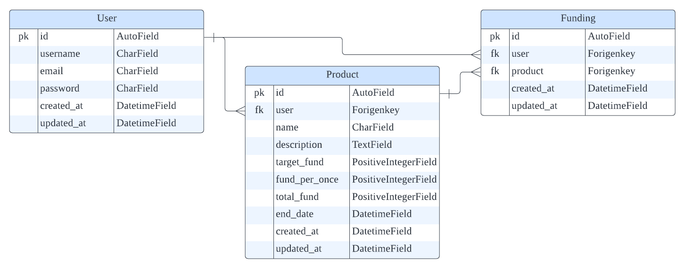

# Crowdfunding
원티드 프리온보딩 코스 선발과제를 기준으로 DRF RE-REVIEW

### Deploy [GoTo](http://52.78.203.26/api/users/signup)

### Progress check [GoTo](https://round-locust-fc4.notion.site/crowdfunding-b915554e142343cda700efc6a5ac7e77)
- 요구사항 분석, 관련 정보 및 프로젝트 상세 진행사항 기록을 위해 사용

## Task interpretation
해당 기능을 사용할 수 있는 권한이 있는 client(상품 게시자, 펀딩 서비스 사용자 등)에게 크라우드 펀딩 기능을 제공하는 서비스라고 해석하였습니다.

## Implementation requirements
- Database
    - [x]  RDB 사용
- REST API
    - [x]  상품 등록
        - `제목`, `게시자명`, `상품설명`, `목표금액`, `펀딩종료일`, `1회펀딩금액`으로 구성
    - [x]  상품 수정
        - 모든 내용이 수정 가능하나 `목표금액`은 수정불가
    - [x]  상품 삭제
        - DB에서 삭제
    - [x]  상품 목록
        - `제목`, `게시자명`, `총펀딩금액`, `달성률`, `D-day`가 포함
        - `달성률`: `총펀딩금액`/`목표금액`100 (소수점 무시)
        - `D-day`: 펀딩 종료일까지
        - [x]  상품 검색: 검색된 문자열 포함된 상품 리스트 조회
        - [x]  상품 정렬: `생성일`, `총펀딩금액` 기준으로 정렬
    - [x]  상품 상세
        - `제목`, `게시자명`, `총펀딩금액`, `달성률`, `D-day`, `상품설명`, `목표금액`, `참여자 수`가 포함
- Implementation
    - ORM 사용 구현 및 JSON 형식 결과 도출
    - 효율성과 적합성을 고려한 설계 및 구현
- Bonus points
    - [x]  Unit test 구현
    - [x]  Git commit convention

## Implementation

### Tech Stack
     

### Development Period
* 2022.07 - 2022.09
* 2022.11 (코드 배포)

> ### ERD


> ### API Specification [GoTo](https://documenter.getpostman.com/view/20879074/2s83mXQTCP)

> ### Implementation Process
- 다양한 View를 이용한 RESTful API 구현
    - ViewSet을 이용한 사용자 API 구현
        - 사용자 회원가입, 로그인, 로그아웃 구현
            - simplejwt를 이용해 token 발행으로 사용자 인증
            - permission customizing을 통한 사용자 접근 권한을 부여
        - 사용자 정보 수정 및 삭제 구현
            - 로그인 시 발행된 access_token으로 인증하지 않을 경우 401 error 리턴
    - CBV, Generics, ViewSets을 이용한 펀딩 API 구현
        - 펀딩 상품 등록, 조회, 수정, 삭제 구현
            - 펀딩 상품 리스트, 상세 조회 시 인증 여부에 상관없이 조회
            - 펀딩 상품 등록, 수정, 삭제 시 로그인 시 발행된 access_token으로 인증하지 않을 경우 401 error 리턴
        - 펀딩 등록, 조회 구현
            - 로그인 시 발행된 access_token으로 인증하지 않을 경우 401 error 리턴
            - 펀딩 리스트 조회 시 사용자 본인이 펀딩한 내역만 조회할 수 있도록 구현
- Pytest를 이용한 test code 작성
    - factoryboy, faker를 사용하여 임의 데이터 생성해 model test code 작성
    - 사용자 본인을 인증할 수 있을 때, 없을 때를 나누어 test code 작성
- Gunigorn, Nginx 적용 및 Docker, AWS EC2 이용한 배포
- Postman을 이용한 API 명세서 작성

### Step to run
> window 환경에서 구현 및 실행되었습니다.

#### Local server
1. github에서 해당 프로젝트의 repository를 clone합니다.
```shell
$ git clone https://github.com/Jjenny-K/crowdfunding.git
```

2-1. PostgerSQL에서 해당 프로젝트와 연동할 database를 생성합니다.

2-2. .env 파일을 root directory에 생성 후, 프로젝트, PostgerSQL과 연동을 위한 정보를 저장합니다.
```
SECRET_KEY='{SECRET_KEY}'

DB_NAME='{local database name}'
DB_USER='{local database user}'
DB_PASS='{local database password}'
DB_HOST='localhost'
```

3. 가상환경을 설정한 후 필요한 라이브러리를 설치합니다.
```shell
$ python -m venv venv
$ venv\Scripts\activate
$ python install -r requirements.txt
```

4. model migration을 진행합니다.
```shell
$ python manage.py migrate --settings=config.settings.develop
```

5. local server를 실행합니다.
```shell
$ python manage.py runserver --settings=config.settings.develop
```

#### Docker server
1. github에서 해당 프로젝트의 repository를 clone합니다.
```shell
$ git clone https://github.com/Jjenny-K/crowdfunding.git
```

2. .env 파일을 root directory에 생성 후, 프로젝트, PostgerSQL과 연동을 위한 정보를 저장합니다.
```
SECRET_KEY='{SECRET_KEY}'

POSTGRES_DB='{container database name}'
POSTGRES_USER='{container database user}'
POSTGRES_PASSWORD='{container database password}'
POSTGERS_HOST='{server host ip}'
```

3. nginx/conf.d/default/conf 파일 내 server_name을 배포용 ip로 변경합니다.

4. docker에 이미지를 만들고 배포를 진행합니다.
```shell
$ sudo docker-compose up -d --build
```

## Author
All of development : :monkey_face: **Kang Jeonghui**
